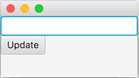
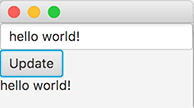

# Notifier

Create a user interface in the class included in the exercise template. It should contain three user interface components. The topmost is a text field (TextField), the middle one is a button (Button), and component on the bottom is a text component (Label). Lay out the components using the VBox class. The user interface should look kind of like the following.

Then add functionality to the application, where pressing the button leads to the text in the text field being copied as the value of the text component. In the example below we have written the message "hello world!" into the text field, after which we have pressed the button.

