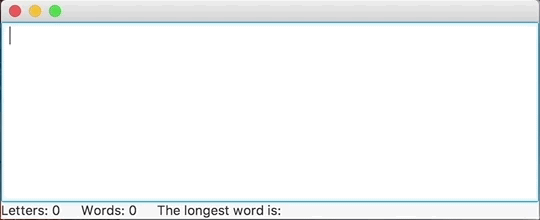

# Text statistics, part II

Copy the work you did in the Text statistics exercise into the class included in the exercise template and add to it the functionality from the example above for calculating the statistics. The end result should an application that calculates statistics based on text that is input, which are updated automatically and displayed in the application.

