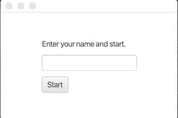

# Greeter

In the exercise template there is a class called GreeterApplication. Create in it an application with two views. The first view should have a text field that's used to ask for the user's name. The second view then shows the user a greeting text. The greeting should be of the form "Welcome name!" where the user's name is inserted in place of 'name'.

An example of how the program should work:

