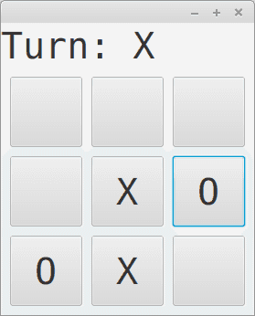

# Tic-tac-toe

In this exercise you will create a tic-tac-toe game of size 3x3. The assignment has been divided into three parts: first we create the parts of the user interface, then the funcionality of the buttons, and finally the option to play the game to conclusion.



NB! You can make the characters in the buttons to be equally large with a suitable font selection. The font that the buttons in the screenshot use has been set in the following manner:

```java
Button btn = new Button(" ");
btn.setFont(Font.font("Monospaced", 40));
```

## Part 1 - User interface

Modify the TicTacToeApplication class so that it starts the graphical user interface. First, use the BorderPane class to create the layout of the UI components. The top of the BorderPane should contain a text component that includes information about the turn, and at the end of the game a message to show that the game has ended. In the middle of the BorderPane create a GridPane that contains 9 buttons. The GridPane should have 3 rows and 3 columns, so that the buttons form a 3x3 grid.

## Part 2 - Taking turns and fair play

The players of the game are X and O. X always takes the first turn. Add the following functionality to the buttons: when a button is pressed, the game updates so that symbol of the current player (X if it was X's turn when the button was pressed) is stored in the button. After this the other player gets their turn.

The text component at the top of the game must always show whose turn it is. The text begins as "Turn: X". Once X finishes their turn by pressing a button, the text should change to "Turn: O". After player O has finished their turn, the text should turn into "Turn: X" again.

NB! If a player has already placed their symbol in a position, the other player cannot choose the same position. Make sure that the turn doesn't change if a player tries to choose a position that already contains a symbol.

NB!! You might encounter the following error: "local variables referenced from a lambda expression must be final or effectively final". This is because objects instanced of interfaces cannot use variables that are defined outside of the method. You can avoid the error by creating new variables that you set the problematic values to just before using them in the method.

## Part 3 - Finishing the game

Add the possibility to finish the game to the program. The game ends if one player positions three of their symbols in a line (horizontally, vertically, or diagonally). The end of the game should be indicated by the text "The end!" at the top of the program. It should be no longer possible to continue the game after this.

The tests of this exercise are not the most detailed ones. Try to create the program without relying on the tests too much.
