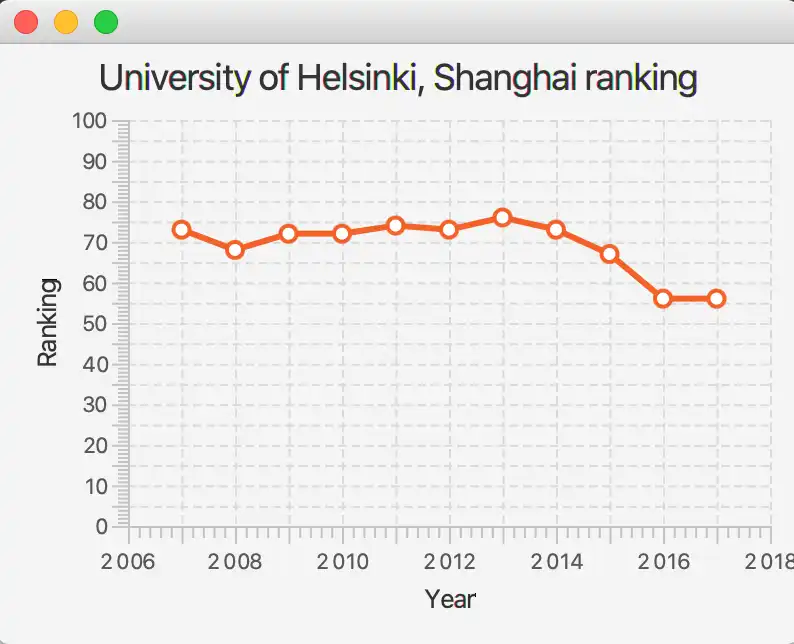

# Shanghai

Universities are compared yearly. One internationally respected comparer is the Shanghai Ranking Consultancy, which published a yearly comparison list of internationally famous universities. The list also includes the rank for each university. The University of Helsinki has obtained the following ranks in the years 2007-2017:

2007 | 73

2008 | 68

2009 | 72

2010 | 72

2011 | 74

2012 | 73

2013 | 76

2014 | 73

2015 | 67

2016 | 56

2017 | 56

You will find the class ShangaiApplication in the exercise base. Create in it a program that shows how the University of Helsinki's ranking has varied during these years. NB! Don't use any layout in the application — give the line chart object directly as the Scene object's constructor parameter. Also take notice that the Scene also needs the width and height of the displayed area as parameters.

The result drawn by the application could like the following example:

