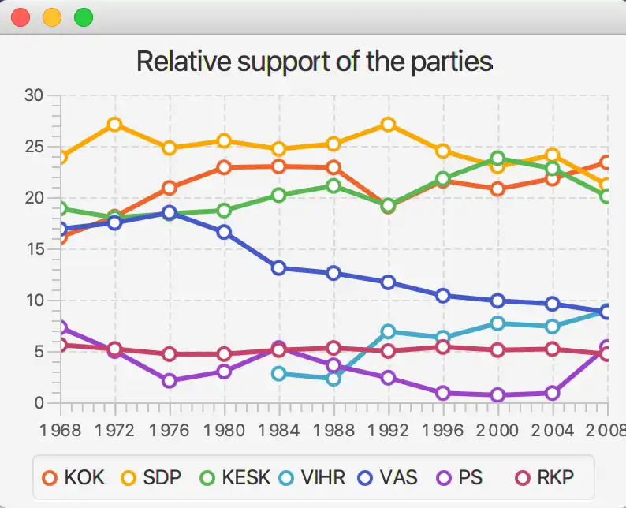

# Finnish parties

The exercise base contains the class PartiesApplication. Create in it an application that displays the relative support of the major Finnish parties during the years 1968-2008. The project contains the raw data that has been used in the previous examples, and it can be found in the file "partiesdata.tsv".

The relative support must be displayed for each party so that a separate line represents each of them in the line chart. Always set the name of the XYChart.Series object to be the party name that can be found in the data (with the help of the setName method).

When creating the x axis that the line chart uses, take notice that the first year that the statistics cover is the year of 1968.

Tab-separated string can be split into parts in the following manner:

```java
String string = "KOK    16.1    18.1    20.9";
String[] pieces = string.split("\t");
System.out.println(pieces[0]);
System.out.println(pieces[1]);
System.out.println(pieces[2]);
System.out.println(pieces[3]);
```

```markdown
KOK
16.1
18.1
20.9
```

To create a floating point number of a string that contains a floating point number, you can use the valueOf method of the Double class. So for instance Double.valueOf("16.1");

The visualization created by the application should look something like this:



Data for similar charts can be found in the PX-Web databases of Statistics Finland
