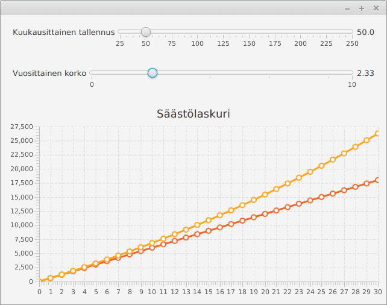
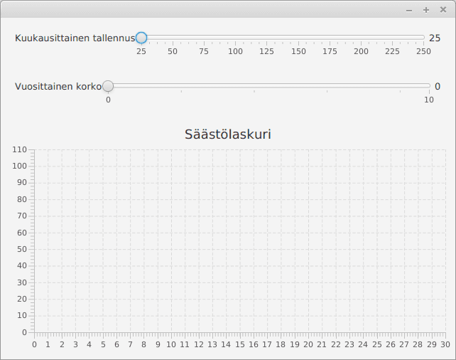
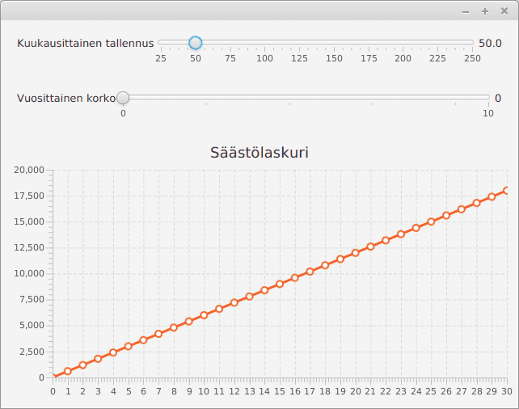
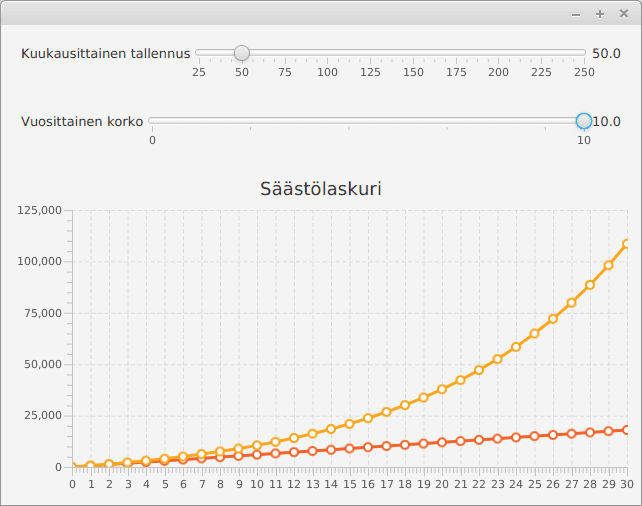

# Savings calculator

In this exercise you will implement a program for calculating and displaying the sum in a savings account. User can give the calculator a sum to save each month and the yearly interest rate, and the calculator will display how the savings will increase over 30 years.

## Part 1 - User interface

First implement the user interface of the program. The components of the application can be managed using a BorderPane. In the middle of the BorderPane add a line chart (LineChart), which has two numerical axis (NumberAxis). On the top of the BorderPane add a VBox component which contains two BorderPanes. The first BorderPane (on top) contains the text "Monthly savings" on the left, a slider in the middle and a text describing the slider on the right. The second BorderPane (below the first one) has the text "Yearly interest rate" on the left, a slider in the middle and a text describing the slider on the right.

You can find tips for using the Slider -class by googling "javafx slider".

Define the Sliders so, that the minimum monthly savings is 25 and the maximum is 250. The minimum yearly interest rate is 0 and the maximum is 10. The x-axis of the line chart displays years from 0-30. The y-axis must adapt to the values being shown.

In this phase the application should look like so:

## Part 2 - Displaying the savings

After the user interface is complete, start implementing the functionality of the program.

Modify the user interface so, that when user changes the sum to save each month (by moving the uppermost slider), the line chart updates to display the savings amount of the new monthly sum. For example when the monthly savings amount is 50, the line chart should have a line showing the values [(0,0), (1,600), (2,1200),(3,1800),...].

In this phase the application should look like so (when the monthly sum to save is 50):

## Part 3 - Displaying the savings and the interest rate

Modify the user interface so, that it shows the interest rate as well. The line chart should have two lines, one for showing just the monthly savings, and one for showing the monthly savings and the interest rate.

Calculate the interest rate yearly according to the expected savings at the end of the year. For example when the monthly savings sum is 50 and the yearly interest rate is 5%, the line chart should have a line showing the values [(0,0), (1, 630), (2, 1291.5), (3, 1986,075), ...].

In this phase the application should look like so (when the monthly sum to save is 50 and the yearly interest rate is 10%):

In the chart we see the compound interest of our savings, although with a very optimistic interest rate. When you have completed the application and returned it, you can for example calculate how saving 25 euros a month with 4% yearly interest rate grows over 50 years.
