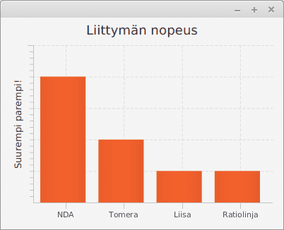

# Unfair advertisement

According to the old saying "There are three kinds of lies: lies, damned lies and statistics.", nothing lies like a statistic. The saying might not be completely wrong, as some statistics are purposefully made difficult to read.

The application in the exercise template opens a visualization used for marketing for an imaginary company. The visualization displays the speed of their internet, and shows a remarkable difference to their competitors.

The comparison however is not really fair, and gives the wrong impression on the situation. Modify the program so, that the comparison is fairer.

This exercise has no automatic tests or model answer, so you can define the comparison with some freedom.
