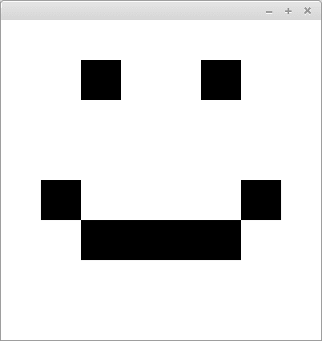

# Smiley

Create a graphical user interface into the class that is supplied with the exercise base. Add a BorderPane into the GUI to be responsible for the application's layout. Add a Canvas object in the middle of the BorderPane. After doing this, use the GraphicsContext object of the Canvas object to draw a smiley. Use white (Color.WHITE) as the background color, and black (Color.BLACK) as the color of the smiley.

The tests in this exercise only check that you draw into the window. Before returning, make sure that drawing the smiley works correctly. Notice that the purpose here is NOT to manually draw the smiley with the mouse — use the methods of the GraphicsContext object so that the picture is already drawn when the program is first started.

