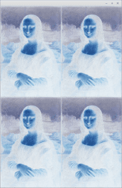
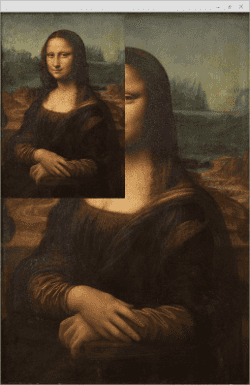
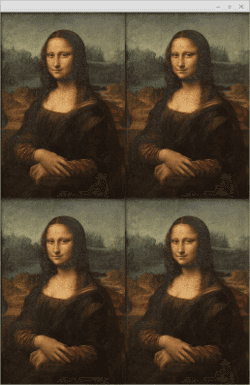

# Collage

Andy Warhol was famous for his photo collages where one or more pictures are repeated multiple times with different colors, for instance.

In this exercise we are going to imitate his style and create an Andy Warhol-ish interpretation of the famous Mona Lisa. The finished program will show Mona Lisa looking like this:

Let's begin.

## Part 1 - Top left corner

In the exercise base there is a program that loads and displays the Mona Lisa. In this section your goal is to create a situation where the Mona Lisa is displayed as a smaller image in the top left corner. The size of the smaller image should be one fourth of the original image.

So in practice the point (0, 0) should contain the value at the coordinates (0, 0). The coordinates at (0, 1) should contain the value at coordinates (0, 2). Similarly, the point (0, 2) should contain the value at the point (0, 4), the point (0, 3) the value at (0, 6), etc. The same holds true with the y-axis, so point (1, 1) should have the value of (2, 2), the point (1, 2) the value of (2, 4), etc.

## Part 2 - Grid

Then modify the program so that the small image at the top left corner is repeated four times in the whole collage. The top-left corner of the first image should be at the coordinates (0, 0). The top-left corner of the second image should be at the point (width of image / 2, 0). The top-left corner of the third image should be at (0, height of image / 2), and the top-left corner of the fourth image should be at (width of image / 2, height of image / 2).

## Part 3 - Negative

You've come this far, and now you can display a grid of four small images. Next, modify the image so that the negative of the original is displayed. You can create a negative by assigning to each pixel, the following color values: the subtraction of the original color from 1. So for the red color this would be red = 1.0 - red.

The Mona Lisa image included in the exercise base has been downloaded from the Wikimedia path <https://commons.wikimedia.org/wiki/Category:Mona_Lisa>. It can be used freely.
