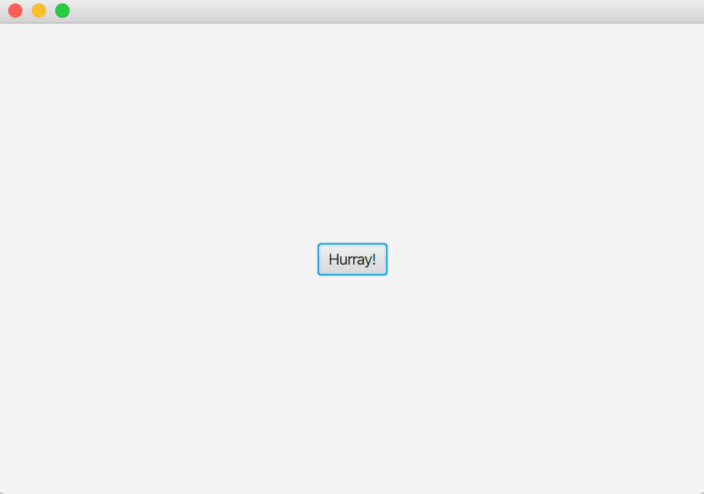

# Hurray

In the root folder of the exercise base there is a file called Applause-Yannick_Lemieux.wav. The file contains a hurray sound. Your task is to create a program that contains a "Hurray!" button. When the user clicks the button, the program should play the audio file included in the project.

The audio file is recorded by Yannick Lemieux. It is licensed with the Creative Commons attribution license <https://creativecommons.org/licenses/by/3.0/>.
